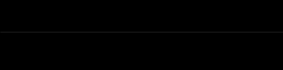

# LENS Spinner

Flutter widget to display a spinner similar to the spinner from the LENS application


## Usage

```dart
import 'package:flutter/material.dart';

import 'package:lens_spinner/lens_spinner.dart';

void main() {
  runApp(const MainApp());
}

class MainApp extends StatelessWidget {
  const MainApp({Key? key}) : super(key: key);

  @override
  Widget build(BuildContext context) {
    return const MaterialApp(
      home: Scaffold(
        backgroundColor: Colors.black,
        body: LensSpinner(
          width: 400,
        ),
      ),
    );
  }
}
```

## Changelog  
  
Refer to the [Changelog](https://github.com/grfc-ru/lens-spinner/blob/main/CHANGELOG.md) to get all release notes.  
  
  
## Features and bugs  
  
Please file feature requests and bugs at the [issue tracker][tracker].
  
[tracker]: https://github.com/grfc-ru/lens-spinner/issues
  
  
## License  
  
[WTFPL](https://github.com/grfc-ru/lens-spinner/blob/main/LICENSE)  